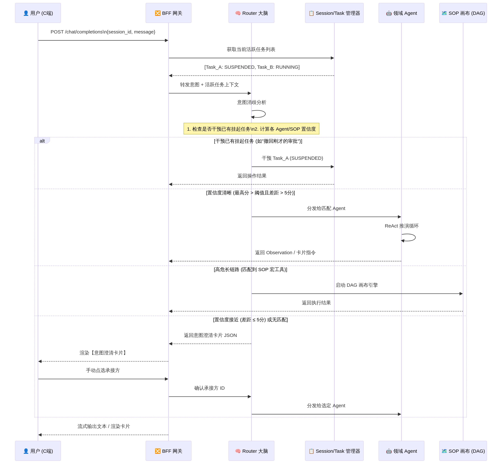
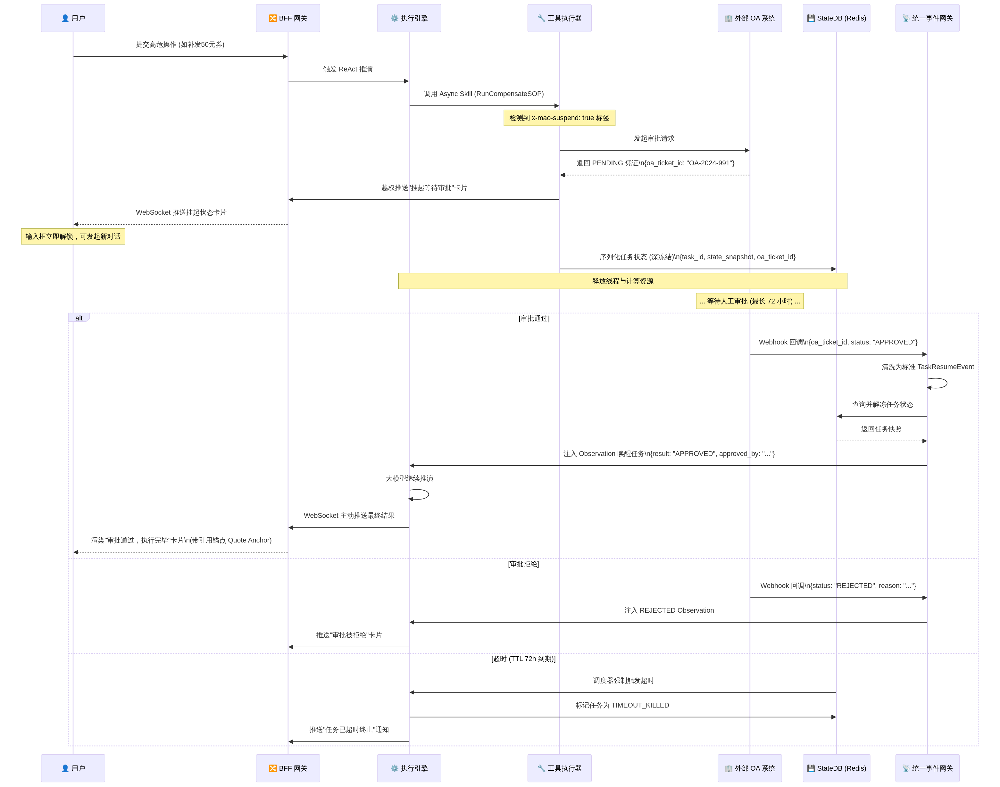
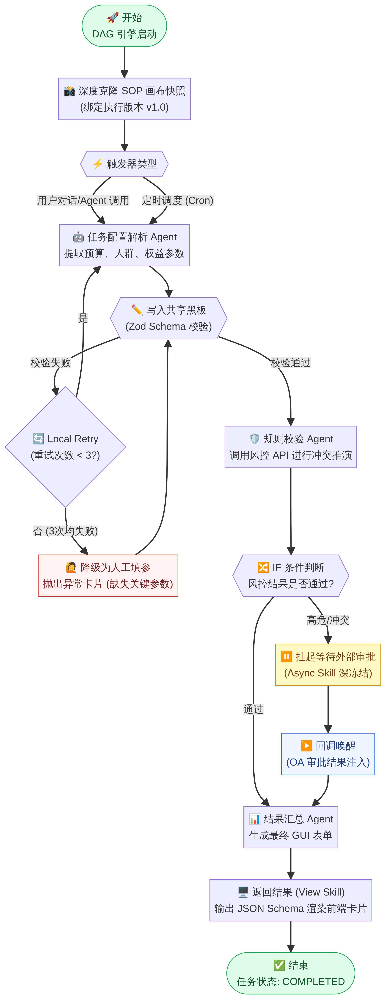
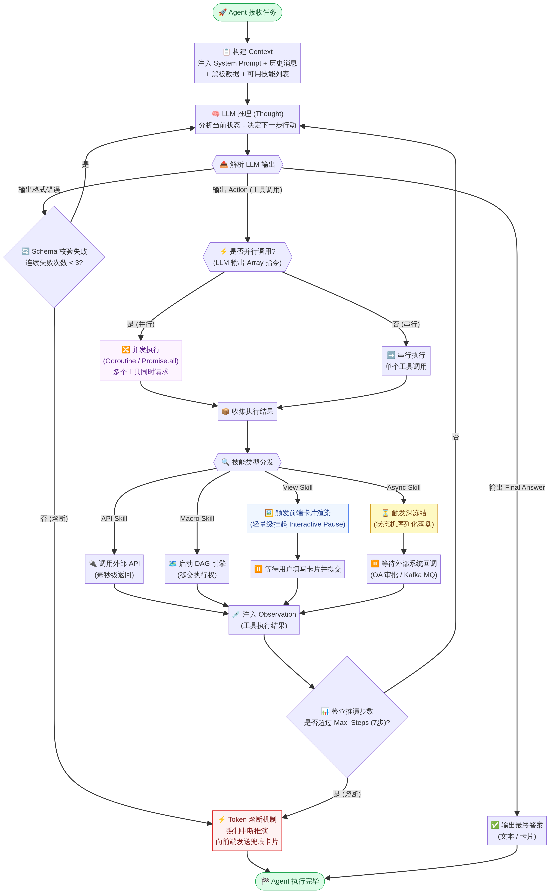
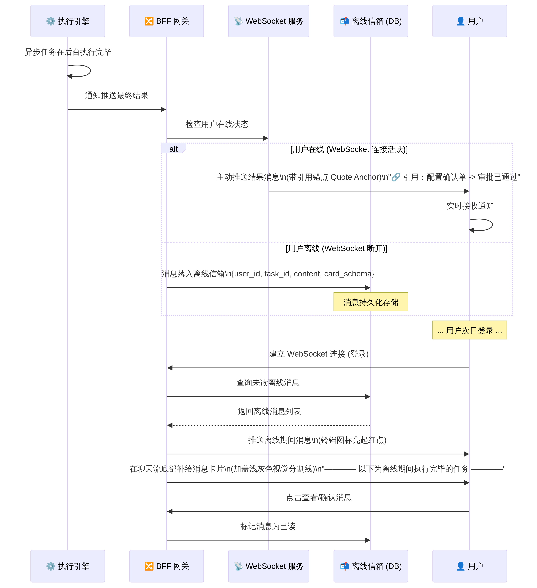
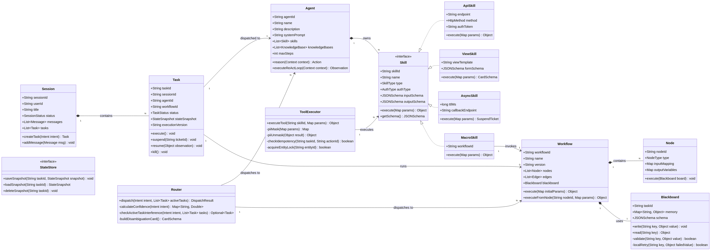

# MAO 平台 — 流程图、类图与枚举定义

> **版本**：V9.0-PROD | **更新日期**：2026-04

---

## 5. 核心流程图与时序图

### 5.1 意图路由与分发时序图

当用户在 C 端工作站输入自然语言指令时，系统通过 Router 大脑进行意图解析和分发。Router 结合当前活跃任务列表进行意图消歧，计算各 Agent/SOP 的匹配置信度，若置信度接近则抛出意图澄清卡片。



### 5.2 长程异步挂起与唤醒时序图 (四阶段流转)

对于涉及 OA 审批等长程异步操作，系统采用深冻结与回调唤醒机制。任务在深冻结后释放线程资源，外部系统通过 Webhook 或 Kafka MQ 回调唤醒任务，最终通过 WebSocket 推送结果给用户。



### 5.3 多智能体 DAG 协同流程图

在 DAG 画布中，多个 Agent 通过强类型的共享黑板进行数据握手。若 Zod 校验失败则触发 Local Retry，3 次失败后降级为人工填参。



### 5.4 ReAct Agent 执行流程图

Agent 内部通过 ReAct 循环执行推理和行动，支持串行与并行两种工具调用模式，并具备 Token 熔断保护机制。



### 5.5 离线信箱与主动触达时序图

异步任务完成后，系统根据用户在线状态决定是实时推送还是落入离线信箱，确保消息不丢失。



---


## 6. 类图与接口设计

### 6.1 核心类图



### 6.2 核心接口定义

#### 6.2.1 技能接口 (Skill Interface)

```java
/**
 * 技能接口，所有技能类型的统一抽象
 * 对大模型而言，所有技能均视为标准工具指令输出
 */
public interface Skill {
    /**
     * 获取技能唯一标识
     */
    String getSkillId();

    /**
     * 获取技能类型
     */
    SkillType getSkillType();

    /**
     * 获取技能输入参数 JSON Schema（供 LLM 生成调用参数）
     */
    JSONSchema getInputSchema();

    /**
     * 执行技能
     * @param params 执行参数（已通过 Schema 校验）
     * @return 执行结果（API Skill 返回数据；View Skill 返回 CardSchema；
     *         Async Skill 返回 SuspendTicket；Macro Skill 返回 DAG 执行结果）
     */
    Object execute(Map<String, Object> params);
}
```

#### 6.2.2 工具执行器接口 (ToolExecutor Interface)

```java
/**
 * 工具执行器接口，负责多态路由分发、PII 脱敏、幂等性检查等
 */
public interface ToolExecutor {
    /**
     * 执行指定的技能
     * @param skillId 技能唯一标识
     * @param parameters 执行参数（原始参数，执行器内部进行 PII 脱敏）
     * @param taskId 当前任务 ID（用于幂等键生成）
     * @param actionId 当前操作 ID（用于幂等键生成）
     * @return 执行结果或挂起凭证
     */
    Object executeTool(String skillId, Map<String, Object> parameters,
                       String taskId, String actionId);
}
```

#### 6.2.3 状态存储接口 (StateStore Interface)

```java
/**
 * 状态存储接口，负责任务状态的深冻结与解冻
 */
public interface StateStore {
    /**
     * 保存任务状态快照（深冻结）
     * @param taskId 任务 ID
     * @param snapshot 完整的任务状态快照（包括 ReAct 历史、黑板数据、执行版本等）
     */
    void saveSnapshot(String taskId, StateSnapshot snapshot);

    /**
     * 加载任务状态快照（解冻）
     * @param taskId 任务 ID
     * @return 状态快照对象
     */
    StateSnapshot loadSnapshot(String taskId);

    /**
     * 删除任务状态快照（任务完成后清理）
     * @param taskId 任务 ID
     */
    void deleteSnapshot(String taskId);
}
```

#### 6.2.4 Router 接口 (Router Interface)

```java
/**
 * Router 路由大脑接口
 */
public interface Router {
    /**
     * 分发用户意图
     * @param intent 解析后的用户意图
     * @param activeTasks 当前会话的活跃任务列表
     * @return 分发结果（包含目标 Agent/SOP ID 或意图澄清卡片）
     */
    DispatchResult dispatch(Intent intent, List<Task> activeTasks);
}
```

---


## 7. 枚举定义规范

### 7.1 任务状态 (TaskStatus)

```java
public enum TaskStatus {
    /** 等待调度，任务已创建但尚未开始执行 */
    PENDING(0, "等待调度"),
    /** 正在执行，ReAct 引擎或 DAG 引擎正在运行 */
    RUNNING(1, "正在执行"),
    /** 挂起等待外部回调，如 OA 审批、人工确认等 */
    SUSPENDED(2, "挂起等待外部回调"),
    /** 执行成功，任务已正常完成 */
    COMPLETED(3, "执行成功"),
    /** 执行失败，包含多种子原因（见 failReason 字段） */
    FAILED(4, "执行失败"),
    /** 超时被强杀，ASYNC 技能超过 TTL 未回调 */
    TIMEOUT_KILLED(5, "超时被强杀");

    private final int code;
    private final String description;

    TaskStatus(int code, String description) {
        this.code = code;
        this.description = description;
    }
    // getters...
}
```

### 7.2 任务失败原因 (TaskFailReason)

```java
public enum TaskFailReason {
    /** 认证被吊销，IAM 已撤销用户权限 */
    FAILED_AUTH_REVOKED("Failed_Auth_Revoked"),
    /** 关键数据缺失，Agent 无法输出必填参数 */
    FAILED_DATA_MISSING("Failed_Data_Missing"),
    /** Token 熔断，超过最大推演步数 */
    FAILED_TOKEN_CIRCUIT_BREAK("Failed_Token_Circuit_Break"),
    /** 实体锁冲突，目标实体已被其他任务锁定 */
    FAILED_ENTITY_LOCK_CONFLICT("Failed_Entity_Lock_Conflict"),
    /** 下游服务异常，外部 API 返回错误 */
    FAILED_DOWNSTREAM_ERROR("Failed_Downstream_Error");

    private final String code;
    // constructor, getters...
}
```

### 7.3 技能类型 (SkillType)

```java
public enum SkillType {
    /** 原子接口，同步读写，毫秒级网络响应，即刻注入 Observation */
    API(1, "原子接口"),
    /** 视图交互，阻断服务端推理流转，转交 BFF 驱动 WebSocket 推送前端渲染卡片 */
    VIEW(2, "视图交互"),
    /** 长程异步，触发大模型线程阻断与"状态机深冻结"，序列化落盘 Redis 等待外部回调唤醒 */
    ASYNC(3, "长程异步"),
    /** 复合编排，将完整 DAG 打包为单一工具启动，移交引擎内部调度嵌套 */
    MACRO(4, "复合编排");

    private final int code;
    private final String description;
    // constructor, getters...
}
```

### 7.4 鉴权方式 (AuthType)

```java
public enum AuthType {
    /** 用户 Token 透传，使用当前登录用户的 Access Token */
    USER_TOKEN("User Token 透传"),
    /** 系统 AK/SK 鉴权，使用平台内部的 Access Key / Secret Key */
    SYSTEM_AK_SK("System AK/SK"),
    /** OAuth2 动态换取，托管 Refresh Token 动态换取短期 Access Token */
    OAUTH2_DYNAMIC("OAuth2 动态换取");

    private final String description;
    // constructor, getters...
}
```

### 7.5 节点类型 (NodeType)

```java
public enum NodeType {
    /** 触发器节点，DAG 的起始点 */
    TRIGGER(1, "触发器"),
    /** 智能体节点，执行 ReAct 推演 */
    AGENT(2, "智能体"),
    /** 条件分支节点，根据条件决定流转路径 */
    CONDITION(3, "条件分支"),
    /** 挂起等待节点，等待外部审批或人工确认 */
    SUSPEND(4, "挂起等待"),
    /** 结束节点，DAG 的终止点 */
    END(5, "结束");

    private final int code;
    private final String description;
    // constructor, getters...
}
```

### 7.6 消息角色 (MessageRole)

```java
public enum MessageRole {
    /** 用户消息 */
    USER("user"),
    /** AI 助理消息 */
    ASSISTANT("assistant"),
    /** 系统消息（如记忆压缩通知、离线信箱分割线） */
    SYSTEM("system");

    private final String value;
    // constructor, getters...
}
```

### 7.7 消息类型 (MessageType)

```java
public enum MessageType {
    /** 纯文本消息 */
    TEXT("TEXT"),
    /** 卡片消息（包含 JSON Schema 的交互卡片） */
    CARD("CARD"),
    /** 系统通知（如记忆压缩提示、离线信箱分割线） */
    SYSTEM_NOTICE("SYSTEM_NOTICE"),
    /** 挂起状态卡片（等待外部审批） */
    SUSPEND_CARD("SUSPEND_CARD");

    private final String value;
    // constructor, getters...
}
```

---
