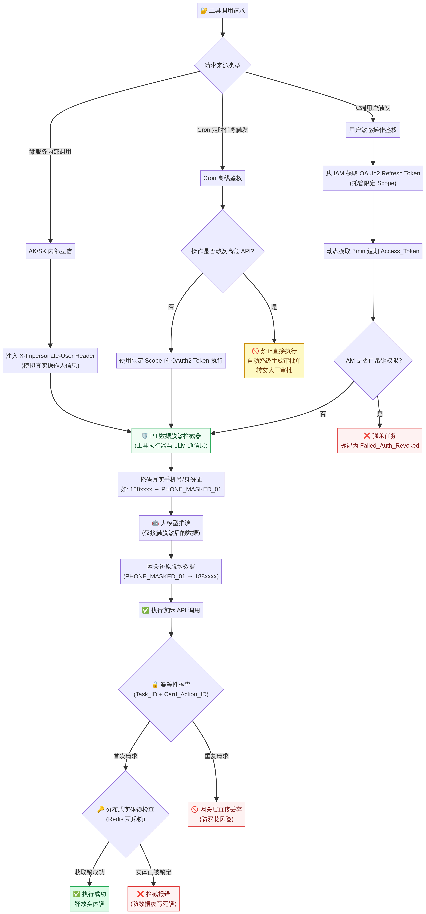

# MAO 平台 — 安全规范与工程实现指南

> **版本**：V9.0-PROD | **更新日期**：2026-04

---

## 9. 安全与容灾规范

### 9.1 权限与身份安全防线

MAO 平台的安全防线分为以下五层：

**防 Cron 离线越权**：严禁完全无人值守的后台任务直接使用超级管理员权限 (God Token)。Cron 任务必须使用托管限定 Scope 的 OAuth2 Refresh Token，每次触发前动态换取 5 分钟有效期的短期 Access_Token 执行。若 IAM 吊销权限，强杀任务为 `Failed_Auth_Revoked`。

**高危动作降级**：涉及资金划拨的高危 API（`is_high_risk = true`）严禁在 Cron 中直接执行，必须自动降级生成审批单转交人工。

**微服务互信**：使用内部 AK/SK 鉴权时，强制在 HTTP Header 注入 `X-Impersonate-User` 模拟真实操作人信息，保证审计真实性。

**PII 数据脱敏防线**：在工具执行器与大模型通信的网关层架设拦截器，进入模型前强制脱敏掩码真实手机号（如替换为 `[PHONE_MASKED_01]`），大模型输出调用工具时再由网关还原，确保模型不碰明文隐私。

**幂等防双花**：C 端产生的系统级指令执行强制绑定 `Task_ID + Card_Action_ID` 作为全局唯一的幂等键。任何刷新或抓包重入的重复请求直接在网关层被丢弃，物理层面杜绝重复发奖等双花风险。

### 9.2 并发与容灾兜底防线

**分布式实体锁**：针对 1:N 架构中多个 Task 同时操作同一业务实体（如同一活动 ID），底层引入 Redis 实体级互斥锁。命中锁定实体时强制拦截报错以防数据覆写死锁。

**大模型 Token 熔断机制**：设定全局最大推演步数 (Max_Steps，如 7 步)。当 ReAct 连续 3 次遭遇 Schema 校验失败或报错时，强制中断推演，向下发兜底卡片提示已保护系统资源。

**DAG 断点续传机制**：若 SOP 画布节点中途遭遇微服务宕机 (如 502)，保存执行断点快照。管理员可在审计日志中一键选择【从失败节点重试】或【跳过该节点】，严防重复跑全链路导致资损。

**全链路执行图快照**：当 Task 实例化时，强制深度克隆其绑定的完整 SOP 画布结构快照。即使全局模板从 v1.0 更新至 v5.0，挂起的任务被唤醒时也仅按"出生时"快照执行。审计日志必须打上版本标签（如 `[执行版本: v1.0]`），确保合规追溯拥有 100% 的脑电图一致性还原。

---

## 10. 工程实现指南

### 10.1 技术栈推荐

| 层级 | 推荐技术 | 说明 |
|---|---|---|
| **C 端前端** | React + TypeScript + TailwindCSS | SSE 流式渲染、WebSocket 实时推送 |
| **B 端前端** | React + React Flow | DAG 画布编辑器 |
| **BFF 网关** | Python (FastAPI) | 原生支持 async/await，处理 SSE/WebSocket 流式响应 |
| **核心后端** | Python (FastAPI + Pydantic) | 调度控制面与执行面，完美契合 AI 生态与 JSON Schema 校验 |
| **状态存储** | Redis (快照) + MySQL (持久化) | Redis 用于深冻结快照，MySQL 用于审计日志 |
| **消息队列** | Apache Kafka | 高并发异步事件处理 |
| **向量数据库** | Milvus 或 Qdrant | RAG 知识库检索 |
| **大模型** | OpenAI GPT-4 / Claude 3.5 | 支持 Function Calling / Tool Use |

### 10.2 关键实现注意事项

**Session 与 Task 的 1:N 设计**：会话视窗 (Session) 仅为前端展示容器，底层可并行跑多个任务 (Task)。当某任务触发长程挂起时，引擎越权向前端推送"等待审批卡片"，前端输入框立即解锁，允许用户发起新对话。

**卡片状态由后端强控**：卡片流转状态（如变为灰色 Disabled）由后端 State 绝对强控，不受浏览器刷新影响。前端在渲染卡片时，必须先向后端查询该 `card_action_id` 的状态，若已提交则渲染为只读灰色状态。

**无状态引擎与深冻结序列化**：执行引擎必须是绝对无状态的。任务状态快照需要序列化 ReAct 的完整历史消息、当前黑板数据、执行版本号、挂起凭证等信息。必须使用 JSON 序列化并存储至外部 StateDB（如 Redis 或 DynamoDB），**严禁将状态快照存入 MySQL 的任务主表中**，以避免行锁竞争和破坏横向扩容能力。

**多渠道适配与连接管理**：L2 网关层必须实现统一的渠道适配器 (Channel Adapter)。对于 Web 端，BFF 维护 WebSocket 连接映射；对于飞书等第三方渠道，适配器负责将内部卡片协议翻译为飞书 Message Card 并调用飞书 OpenAPI 下发。离线信箱机制也应由适配层根据渠道特性决定是重连推送（Web）还是直接调用机器人接口发送（飞书）。
