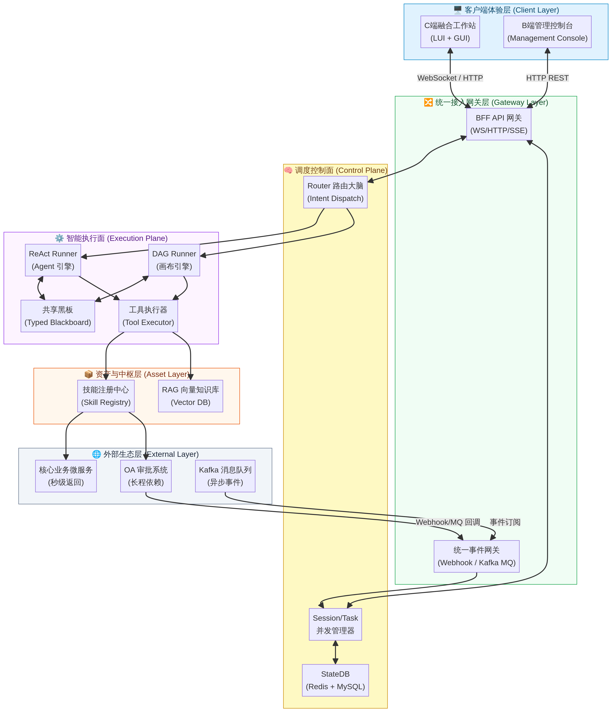
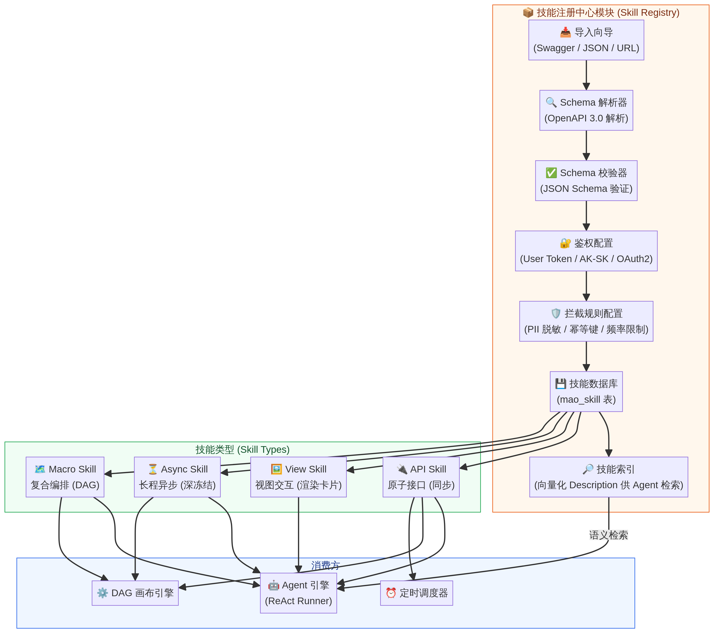

# MAO 平台 — 系统架构设计

> **版本**：V9.0-PROD | **更新日期**：2026-04

---

## 2. 全局系统架构分层

MAO 采用**"控制面与执行面彻底分离"**的设计，全景分为六层边界。

### 2.1 六层架构总览

| 层级 | 名称 | 核心职责 | 关键组件 |
|---|---|---|---|
| L1 | 客户端体验层 | 提供 C 端 LUI+GUI 融合交互与 B 端管理控制台 | C端工作站、B端控制台 |
| L2 | 统一接入网关层 | 统一处理 HTTP/WS 请求及外部事件回调 | BFF API 网关、统一事件网关 |
| L3 | 调度控制面 | 意图路由、会话/任务并发管理、状态持久化 | Router、Session/Task 管理器、StateDB |
| L4 | 智能执行面 | Agent 推演、DAG 编排、工具执行 | ReAct Runner、DAG Runner、Blackboard、Tool Executor |
| L5 | 资产与中枢层 | 技能资产管理与知识库检索 | 技能注册中心、RAG 向量知识库 |
| L6 | 外部生态层 | 对接业务微服务、OA 审批、消息队列 | 业务微服务、OA 系统、Kafka |

### 2.2 C 端工作站核心功能

C 端工作站 (LUI + GUI) 的核心设计要点如下：

**LUI + GUI 融合交互**：接收自然语言意图并流式输出，当涉及参数确认、高危写入时，前端将动态渲染可交互的表单卡片。卡片提交后即锁定为不可交互的灰色只读状态，由后端 State 绝对强控，不受浏览器刷新影响。

**AI 托管大盘 (My Scheduler)**：侧边栏独立展示个人名下的后台定时任务和盯盘任务，支持直观查看存活期、一键暂停/恢复、强制终止以及过期续签。

**会话记忆温和管控**：为防 Token 爆仓，后端采用滑动窗口压缩记忆。当触发深度压缩时，前端聊天框顶部需轻量弹出提示，并强化顶部的【清空重置】按钮视觉。

### 2.3 B 端控制台核心功能

| 模块 | 功能说明 |
|---|---|
| **智能体工厂** | 可视化组装领域 Agent，支持 System Prompt 编写、RAG 知识库关联与专属 Tool 复选框挂载绑定 |
| **全局编排画布** | 基于 React Flow 的 DAG 可视化界面，用于将高危、长链路业务固化为标准操作程序 (SOP) |
| **技能注册中心** | 统一导入与管理底层 OpenAPI，提供 4 种底层技能类型的快速注册向导 |
| **定时调度管理** | 管理全局 Cron 任务，支持条件触发与定时触发两种模式 |
| **会话审计日志** | 提供 100% 可观测的"链路脑电图"，精准记录路由、推演及工具调用的 JSON 级明细 |
| **监控调度大盘** | 全局掌控大模型消耗、系统健康度与 AI 托管任务状态 |

---

## 3. 核心模块详细设计

### 3.1 Router 路由大脑

Router 是 MAO 平台的核心调度中枢，采用**两级分发架构**。

**第一级**：Router 接收用户意图，结合当前活跃任务列表进行意图消歧。若用户输入"撤回刚才的审批"，则干预旧任务；若输入无关指令，则并发孵化物理隔离的新 Task。

**第二级**：Router 的匹配依据是载体的"职责边界（Description）"，只负责将意图分发给特定的 Agent 或 SOP 画布。被唤醒的 Agent 在内部推演时，才自主决定挑选兜里挂载的哪项工具。

**交互式消歧兜底**：当多个 Agent 的职责出现重叠，导致 Router 计算出的置信度极其接近（如 Agent A 85分，Agent B 83分），或完全无法匹配时，Router 绝不盲猜，而是中止分发，在前端抛出【意图澄清卡片】，由人类手动点选承接方。

### 3.2 智能执行面 — 双引擎设计

#### 3.2.1 ReAct Runner (Agent 引擎)

Agent 内部支持三大协同模式：

| 模式 | 适用场景 | 实现方式 |
|---|---|---|
| **串行推演** | 互有依赖的技能调用（如获取 UserID 后再调用发券接口） | 顺序执行 ReAct 循环 |
| **并行并发调用** | 无关联的信息收集 | LLM 输出包含多个指令的 Array，底层开启多线程并发请求 |
| **降维打击 (SOP Macro)** | 包含 5 个以上步骤的高危长链路 | 强制调用由架构师在画布画好的"宏工具"，移交 DAG 引擎 |

**Token 熔断机制**：设定全局最大推演步数 (Max_Steps，如 7 步)。当 ReAct 连续 3 次遭遇 Schema 校验失败或报错时，强制中断推演，向下发兜底卡片提示已保护系统资源。

#### 3.2.2 DAG Runner (画布引擎)

DAG Runner 负责执行 SOP 画布中的有向无环图。关键设计要点：

**全链路执行图快照**：当 Task 实例化时，强制深度克隆其绑定的完整 SOP 画布结构快照。即使全局模板从 v1.0 更新至 v5.0，挂起的任务被唤醒时也仅按"出生时"快照执行。

**DAG 断点续传机制**：若 SOP 画布节点中途遭遇微服务宕机 (如 502)，保存执行断点快照。管理员可在审计日志中一键选择【从失败节点重试】或【跳过该节点】，严防重复跑全链路导致资损。

**双引擎无限嵌套**：ReAct 引擎与 DAG 画布引擎可互相递归调用（Agent in Workflow, Workflow in Agent），实现高度的混合编排能力。

#### 3.2.3 强类型共享黑板 (Typed Blackboard)

在 DAG 节点流转中彻底废弃易导致幻觉的全量对话透传。所有 Agent 通过内存中的全局哈希表（黑板）进行数据握手。

黑板配备预定义的 JSON Schema，Agent 写入时利用 Zod/Pydantic 引擎进行拦截校验，并在系统 Prompt 末尾动态注入明确的 Markdown 约束指引（如"严禁创造任何其他键名"）。

**多智能体幻觉纠偏**：如果 Agent 无法输出符合黑板 Schema 的参数，先触发将"Schema 结构与错误输出打包"重新喂给模型的 Local Retry。若 3 次局部重试仍无法输出下游必备的强依赖参数，执行引擎立即阻断流程，标记为 `Failed_Data_Missing`，并抛出异常卡片，将机器死锁降级为向人类索要填参的轻量级交互。

### 3.3 技能注册中心 (Skill Registry)

技能注册中心是 MAO 平台的"原子武器库"，统一导入与管理底层 OpenAPI 和视图/异步组件。

对大模型而言心智负担为 0，均视为标准工具指令输出，但底层"工具执行器"实施多态路由分发 (Polymorphic Dispatcher)，严格分为四大类：

| 技能类型 | 标识 | 执行机制 | 典型场景 |
|---|---|---|---|
| **原子接口** | `API` | 同步读写，毫秒级网络响应，即刻注入 Observation | 查询任务配置、发送告警消息 |
| **视图交互** | `VIEW` | 阻断服务端推理流转，转交 BFF 驱动 WebSocket 推送前端渲染卡片，执行轻量级挂起 | 任务配置确认单、风控参数填写 |
| **长程异步** | `ASYNC` | 声明式打上 `x-mao-suspend: true` 标签，触发大模型线程阻断与"状态机深冻结"，序列化落盘 Redis 等待外部回调唤醒 | OA 审批流、人工复核 |
| **复合编排** | `MACRO` | 将完整 DAG 打包为单一工具启动，移交引擎内部调度嵌套 | 上线前资损风险排查 SOP、客诉补发补偿金 |

---
