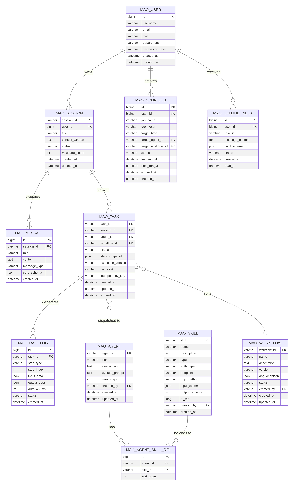

# MAO 平台 — 数据模型设计

> **版本**：V9.0-PROD | **更新日期**：2026-04

---

## 4. 数据库实体表设计

> **契约对齐说明**：接口字段、枚举及错误码的唯一源头为 `design/04_api/api_reference.md`。本文件仅描述存储模型与约束；若与 API 文档存在差异，以 API 文档为准，并需在同一变更中完成同步修订。

### 4.1 实体关系图 (ER Diagram)

### 4.2 核心表结构详细设计

#### 4.2.1 用户表 `mao_user`

| 字段名 | 类型 | 约束 | 说明 |
|---|---|---|---|
| `id` | `BIGINT` | PK, AUTO_INCREMENT | 用户主键 |
| `username` | `VARCHAR(64)` | NOT NULL, UNIQUE | 用户名 |
| `email` | `VARCHAR(128)` | NOT NULL, UNIQUE | 邮箱 |
| `role` | `VARCHAR(32)` | NOT NULL | 角色：`ADMIN` / `OPERATOR` / `VIEWER` |
| `department` | `VARCHAR(64)` | | 所属部门 |
| `permission_level` | `VARCHAR(8)` | NOT NULL, DEFAULT 'L1' | 权限等级：L1/L2/L3/L4 |
| `created_at` | `DATETIME` | NOT NULL | 创建时间 |
| `updated_at` | `DATETIME` | NOT NULL | 更新时间 |

#### 4.2.2 会话表 `mao_session`

| 字段名 | 类型 | 约束 | 说明 |
|---|---|---|---|
| `session_id` | `VARCHAR(64)` | PK | 会话唯一标识，格式：`sess_{uuid}` |
| `user_id` | `BIGINT` | FK → mao_user.id | 所属用户 |
| `title` | `VARCHAR(256)` | | 会话标题（由首条消息自动生成） |
| `context_window` | `TEXT` | | 当前滑动窗口内的压缩上下文 |
| `status` | `VARCHAR(32)` | NOT NULL, DEFAULT 'ACTIVE' | 状态：`ACTIVE` / `ARCHIVED` |
| `message_count` | `INT` | NOT NULL, DEFAULT 0 | 消息总数 |
| `created_at` | `DATETIME` | NOT NULL | 创建时间 |
| `updated_at` | `DATETIME` | NOT NULL | 更新时间 |

#### 4.2.3 消息表 `mao_message`

| 字段名 | 类型 | 约束 | 说明 |
|---|---|---|---|
| `id` | `BIGINT` | PK, AUTO_INCREMENT | 消息主键 |
| `session_id` | `VARCHAR(64)` | FK → mao_session.session_id | 所属会话 |
| `role` | `VARCHAR(16)` | NOT NULL | 角色：`user` / `assistant` / `system` |
| `content` | `TEXT` | | 文本内容 |
| `message_type` | `VARCHAR(32)` | NOT NULL, DEFAULT 'TEXT' | 类型：`TEXT` / `CARD` / `SYSTEM_NOTICE` |
| `card_schema` | `JSON` | | 卡片 JSON Schema（当 type=CARD 时） |
| `created_at` | `DATETIME` | NOT NULL | 创建时间 |

#### 4.2.4 任务表 `mao_task`

| 字段名 | 类型 | 约束 | 说明 |
|---|---|---|---|
| `task_id` | `VARCHAR(64)` | PK | 任务唯一标识，格式：`task_{uuid}` |
| `session_id` | `VARCHAR(64)` | FK → mao_session.session_id | 所属会话 |
| `agent_id` | `VARCHAR(64)` | FK → mao_agent.agent_id | 承接的 Agent（与 workflow_id 二选一） |
| `workflow_id` | `VARCHAR(64)` | FK → mao_workflow.workflow_id | 承接的 SOP 画布（与 agent_id 二选一） |
| `status` | `VARCHAR(32)` | NOT NULL, DEFAULT 'PENDING' | 任务状态（见枚举定义） |
| `state_snapshot_key` | `VARCHAR(128)` | INDEX | **StateDB 外置快照的 Key**，实际快照存储于 Redis/DynamoDB，严禁存入本表 |
| `execution_version` | `VARCHAR(32)` | | 执行时绑定的 SOP 版本号（如 v1.0） |
| `oa_ticket_id` | `VARCHAR(64)` | | 关联的 OA 审批单号 |
| `idempotency_key` | `VARCHAR(128)` | UNIQUE | 幂等键：`{task_id}_{card_action_id}` |
| `created_at` | `DATETIME` | NOT NULL | 创建时间 |
| `updated_at` | `DATETIME` | NOT NULL | 更新时间 |
| `expired_at` | `DATETIME` | | 任务过期时间（用于 TTL 强杀） |

#### 4.2.5 任务执行日志表 `mao_task_log`

| 字段名 | 类型 | 约束 | 说明 |
|---|---|---|---|
| `id` | `BIGINT` | PK, AUTO_INCREMENT | 日志主键 |
| `task_id` | `VARCHAR(64)` | FK → mao_task.task_id, INDEX | 所属任务 |
| `step_type` | `VARCHAR(32)` | NOT NULL | 步骤类型：`ROUTER` / `THOUGHT` / `ACTION` / `OBSERVATION` |
| `step_index` | `INT` | NOT NULL | 步骤序号（从 0 开始） |
| `input_data` | `JSON` | | 步骤输入数据 |
| `output_data` | `JSON` | | 步骤输出数据 |
| `duration_ms` | `INT` | | 执行耗时（毫秒） |
| `status` | `VARCHAR(32)` | NOT NULL, DEFAULT 'SUCCESS' | 状态：`SUCCESS` / `FAILED` / `SKIPPED` |
| `created_at` | `DATETIME` | NOT NULL | 创建时间 |

#### 4.2.6 智能体配置表 `mao_agent`

| 字段名 | 类型 | 约束 | 说明 |
|---|---|---|---|
| `agent_id` | `VARCHAR(64)` | PK | Agent 唯一标识，格式：`agent_{uuid}` |
| `name` | `VARCHAR(128)` | NOT NULL | Agent 名称（如"任务管理 Agent"） |
| `description` | `TEXT` | NOT NULL | Agent 职责描述（Router 匹配依据） |
| `system_prompt` | `TEXT` | NOT NULL | System Prompt 完整内容 |
| `max_steps` | `INT` | NOT NULL, DEFAULT 7 | 最大推演步数（熔断阈值） |
| `rag_kb_ids` | `JSON` | | 关联的 RAG 知识库 ID 列表 |
| `created_by` | `BIGINT` | FK → mao_user.id | 创建人 |
| `created_at` | `DATETIME` | NOT NULL | 创建时间 |
| `updated_at` | `DATETIME` | NOT NULL | 更新时间 |

#### 4.2.7 技能注册表 `mao_skill`

| 字段名 | 类型 | 约束 | 说明 |
|---|---|---|---|
| `skill_id` | `VARCHAR(64)` | PK | 技能唯一标识（如 `QueryTaskConfig`） |
| `name` | `VARCHAR(128)` | NOT NULL | 技能名称 |
| `description` | `TEXT` | NOT NULL | 技能功能描述（供 Agent 语义检索） |
| `type` | `VARCHAR(16)` | NOT NULL | 技能类型：`API` / `VIEW` / `ASYNC` / `MACRO` |
| `auth_type` | `VARCHAR(32)` | NOT NULL | 鉴权方式：`USER_TOKEN` / `AK_SK` / `OAUTH2` |
| `endpoint` | `VARCHAR(256)` | | HTTP 接口路径（API 类型必填） |
| `http_method` | `VARCHAR(8)` | | HTTP 方法：`GET` / `POST` / `PUT` / `DELETE` |
| `input_schema` | `JSON` | NOT NULL | 输入参数 JSON Schema |
| `output_schema` | `JSON` | | 输出结果 JSON Schema |
| `ttl_ms` | `BIGINT` | | 最大存活时间（ASYNC 类型必填，单位毫秒） |
| `pii_fields` | `JSON` | | 需要脱敏的 PII 字段列表 |
| `is_high_risk` | `TINYINT(1)` | NOT NULL, DEFAULT 0 | 是否为高危 API（禁止在 Cron 中直接执行） |
| `created_by` | `BIGINT` | FK → mao_user.id | 创建人 |
| `created_at` | `DATETIME` | NOT NULL | 创建时间 |

#### 4.2.8 智能体技能关联表 `mao_agent_skill_rel`

| 字段名 | 类型 | 约束 | 说明 |
|---|---|---|---|
| `id` | `BIGINT` | PK, AUTO_INCREMENT | 主键 |
| `agent_id` | `VARCHAR(64)` | FK → mao_agent.agent_id | 智能体 ID |
| `skill_id` | `VARCHAR(64)` | FK → mao_skill.skill_id | 技能 ID |
| `sort_order` | `INT` | NOT NULL, DEFAULT 0 | 排序权重（影响 Agent 工具列表顺序） |

#### 4.2.9 SOP 工作流表 `mao_workflow`

| 字段名 | 类型 | 约束 | 说明 |
|---|---|---|---|
| `workflow_id` | `VARCHAR(64)` | PK | 工作流唯一标识，格式：`wf_{uuid}` |
| `name` | `VARCHAR(128)` | NOT NULL | 工作流名称（如"上线前资损风险排查 SOP"） |
| `description` | `TEXT` | | 工作流描述 |
| `version` | `VARCHAR(32)` | NOT NULL, DEFAULT 'v1.0' | 版本号 |
| `dag_definition` | `LONGTEXT` | NOT NULL | DAG 图定义 JSON（节点、边、参数映射） |
| `status` | `VARCHAR(32)` | NOT NULL, DEFAULT 'DRAFT' | 状态：`DRAFT` / `PUBLISHED` / `DEPRECATED` |
| `macro_skill_id` | `VARCHAR(64)` | | 注册为宏工具后对应的 skill_id |
| `created_by` | `BIGINT` | FK → mao_user.id | 创建人 |
| `created_at` | `DATETIME` | NOT NULL | 创建时间 |
| `updated_at` | `DATETIME` | NOT NULL | 更新时间 |

#### 4.2.10 定时任务表 `mao_cron_job`

| 字段名 | 类型 | 约束 | 说明 |
|---|---|---|---|
| `id` | `BIGINT` | PK, AUTO_INCREMENT | 主键 |
| `user_id` | `BIGINT` | FK → mao_user.id | 所属用户 |
| `job_name` | `VARCHAR(128)` | NOT NULL | 任务名称（如"双十一预算盯盘雷达"） |
| `trigger_type` | `VARCHAR(16)` | NOT NULL | 触发类型：`CRON` / `CONDITION` |
| `cron_expr` | `VARCHAR(64)` | | Cron 表达式（CRON 类型必填） |
| `condition_rule` | `JSON` | | 条件触发规则（CONDITION 类型必填） |
| `target_type` | `VARCHAR(16)` | NOT NULL | 目标类型：`AGENT` / `WORKFLOW` |
| `target_agent_id` | `VARCHAR(64)` | FK → mao_agent.agent_id | 目标 Agent ID |
| `target_workflow_id` | `VARCHAR(64)` | FK → mao_workflow.workflow_id | 目标工作流 ID |
| `status` | `VARCHAR(32)` | NOT NULL, DEFAULT 'ACTIVE' | 状态：`ACTIVE` / `PAUSED` / `EXPIRED` |
| `last_run_at` | `DATETIME` | | 上次执行时间 |
| `next_run_at` | `DATETIME` | | 下次执行时间 |
| `expired_at` | `DATETIME` | | 过期时间 |
| `created_at` | `DATETIME` | NOT NULL | 创建时间 |

#### 4.2.11 渠道账号绑定表 `mao_channel_account`

统一管理用户在各渠道的外部身份映射，支持飞书、钉钉、企业微信等第三方渠道的用户身份与系统内部用户的绑定。

| 字段名 | 类型 | 约束 | 说明 |
|---|---|---|---|
| `id` | `BIGINT` | PK, AUTO_INCREMENT | 主键 |
| `user_id` | `BIGINT` | FK → mao_user.id, INDEX | 系统内部用户 ID |
| `channel_type` | `VARCHAR(32)` | NOT NULL | 渠道类型：`WEB` / `FEISHU` / `DINGTALK` / `WECOM` |
| `external_user_id` | `VARCHAR(128)` | NOT NULL | 外部渠道的用户唯一标识（如飞书 OpenID） |
| `external_app_id` | `VARCHAR(128)` | | 外部应用 ID（如飞书 App ID） |
| `access_token` | `TEXT` | | 渠道访问凭证（加密存储） |
| `token_expires_at` | `DATETIME` | | 凭证过期时间 |
| `created_at` | `DATETIME` | NOT NULL | 创建时间 |
| `updated_at` | `DATETIME` | NOT NULL | 更新时间 |

#### 4.2.12 渠道会话映射表 `mao_channel_session`

将外部渠道的会话标识（如飞书的 ChatID）与 MAO 内部 Session 进行映射，保证同一渠道的同一运营群组对话历史的连续性。

| 字段名 | 类型 | 约束 | 说明 |
|---|---|---|---|
| `id` | `BIGINT` | PK, AUTO_INCREMENT | 主键 |
| `session_id` | `VARCHAR(64)` | FK → mao_session.session_id | MAO 内部 Session ID |
| `channel_type` | `VARCHAR(32)` | NOT NULL | 渠道类型 |
| `external_chat_id` | `VARCHAR(256)` | NOT NULL | 外部渠道会话/群组 ID（如飞书 ChatID） |
| `external_app_id` | `VARCHAR(128)` | NOT NULL | 外部应用 ID |
| `created_at` | `DATETIME` | NOT NULL | 创建时间 |

#### 4.2.13 离线信箱表 `mao_offline_inbox`

用于存储用户离线期间产生的消息。渠道适配层在用户重新上线时，根据 `channel_type` 决定是通过 WebSocket 重连推送（Web）还是直接调用机器人接口发送（飞书）。

| 字段名 | 类型 | 约束 | 说明 |
|---|---|---|---|
| `id` | `BIGINT` | PK, AUTO_INCREMENT | 主键 |
| `user_id` | `BIGINT` | FK → mao_user.id, INDEX | 目标用户 |
| `task_id` | `VARCHAR(64)` | FK → mao_task.task_id | 关联任务 |
| `channel_type` | `VARCHAR(32)` | NOT NULL, DEFAULT 'WEB' | 目标渠道：`WEB` / `FEISHU` / `DINGTALK` / `WECOM` |
| `message_content` | `TEXT` | NOT NULL | 消息文本内容 |
| `card_schema` | `JSON` | | 消息卡片 Schema（渠道适配层负责根据渠道翻译格式） |
| `status` | `VARCHAR(16)` | NOT NULL, DEFAULT 'UNREAD' | 状态：`UNREAD` / `READ` |
| `created_at` | `DATETIME` | NOT NULL | 创建时间 |
| `read_at` | `DATETIME` | | 阅读时间 |

---
