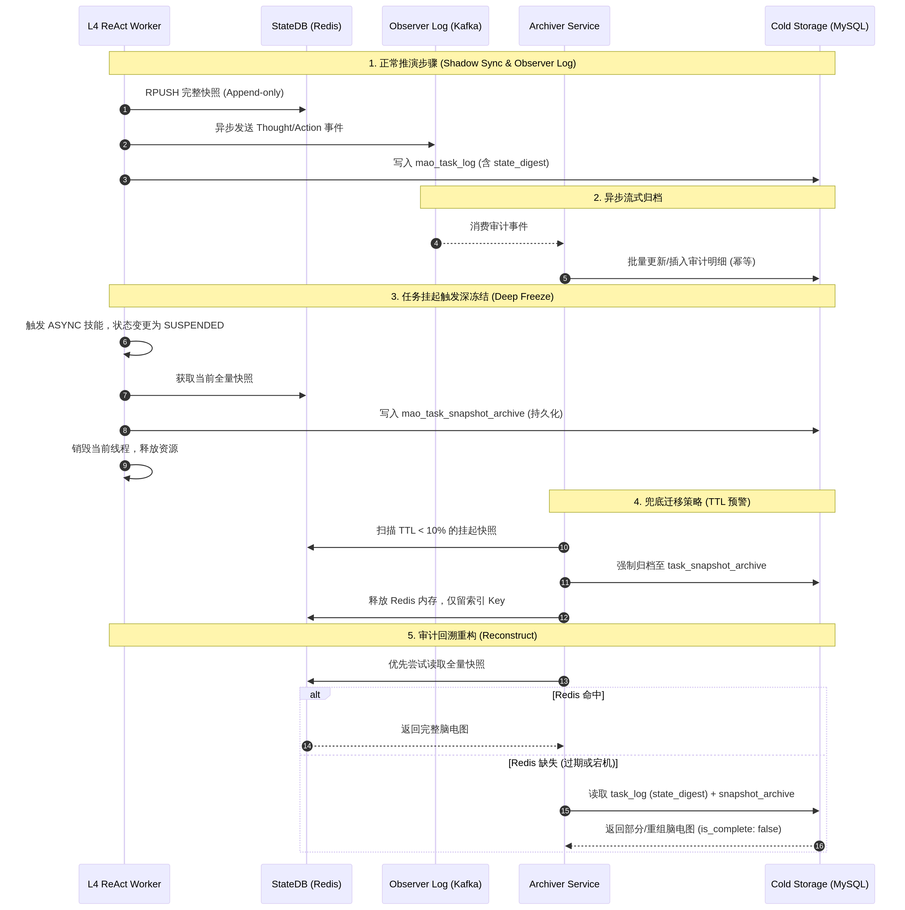

# MAO 平台 — 热冷数据一致性与审计保障体系

> **版本**：V9.5-PROD | **更新日期**：2026-04

---

## 1. 设计背景与核心挑战

MAO 平台采用无状态 Worker 架构，执行引擎在推演过程中将状态快照（State Snapshot）高频写入 Redis（热态存储）。然而，Redis 数据具有易失性（随任务结束或过期而清理），而 MySQL（冷态存储）仅保存任务元数据。这种"热冷数据失步"会导致两个严重问题：
1. **审计延迟与盲区**：若任务在中间步骤崩溃或 Redis 宕机，MySQL 中只有结果无过程，审计人员无法还原"脑电图"。
2. **长程挂起状态丢失**：对于等待数天的 OA 审批任务，若 Redis 内存淘汰策略误删快照，任务将无法被唤醒。

为此，MAO 平台引入**多层次热冷数据一致性保障体系**，确保 100% 的执行链条可追溯性。

---

## 2. 核心保障机制

### 2.1 关键状态同步 (Shadow Sync)

在 `mao_task_log` 表中新增 `state_digest`（状态摘要）JSON 字段。Worker 每完成一个 ReAct 推演步骤（Step），在向 Redis 写入全量快照的同时，提取核心业务变量同步写入 MySQL。

**`state_digest` 结构规范**：
```json
{
  "blackboard_snapshot": {"user_id": "u123", "budget": 20000},
  "execution_version": "v1.2",
  "token_usage": {"prompt": 1200, "completion": 340}
}
```
*效果：即使 Redis 宕机，审计人员仍能通过 MySQL 还原出每一步推演时的关键决策依据。*

### 2.2 观察者日志模式 (Observer Log)

在 L4 执行面与 L2 适配层之间架设透明的审计拦截器。所有由大模型生成的 Thought 以及发往渠道适配层的 Card_Schema，在发出的一瞬间即由网关层异步丢入 Kafka，进入持久化存储。这种模式不依赖执行引擎的状态落盘，从"通信链路"层面截获信息，彻底消除因引擎崩溃导致的状态丢失风险。

**Kafka Topic 规划**：

| Topic 名 | 生产者 | 消费者 | 说明 |
|---|---|---|---|
| `mao.audit.thought` | L4 ReAct Runner | Archiver | 大模型每次 Thought 输出 |
| `mao.audit.action` | L4 Tool Executor | Archiver | 工具调用请求与响应 |
| `mao.audit.card_emit` | L2 Channel Adapter | Archiver | 卡片下发存证 |
| `mao.audit.callback` | L2 Event Gateway | Archiver | 外部回调接收存证 |

### 2.3 双写与延迟归档策略

为了兼顾性能（Redis）与可靠性（MySQL），优化快照的生命周期管理：

1. **即时双写（挂起触发）**：当任务进入 `SUSPENDED` 状态时，适配层强制触发一次"深冻结"快照归档，将此时的 Redis 完整快照序列化并存入 MySQL 的专用表 `mao_task_snapshot_archive` 中。
2. **异步流式归档**：利用 Kafka 消费 `task_log` 事件，由独立的归档服务（Archiver）负责将 Redis 中的中间态数据定期、批量地同步到 MySQL 中。Archiver 消费时必须以 `task_id + step_index` 作为幂等键。

### 2.4 StateDB 持久化策略优化

1. **Redis AOF 策略**：将 Redis 的持久化策略配置为 `appendfsync everysec`，并在执行引擎端使用 `RPUSH` 以 Append-only 方式记录每步快照。
2. **事件驱动迁移**：对于生命周期较长的任务，不依赖定时扫描，而是基于事件触发迁移：
   - **触发器一**：任务状态变更为 `SUSPENDED` → 立即归档至 MySQL。
   - **触发器二**：Redis Key TTL 剩余不足 10% → 预警并触发归档。
   - **触发器三**：兜底定时扫描（每 15 分钟），处理遗漏的边缘情况。

### 2.5 脑电图一致性与回溯重构

提供 `GET /admin/audit/traces/{trace_id}/reconstruct` 接口，实现审计视角的"断点还原"。
- **版本锚点**：在 MySQL 任务表和日志表中强制记录 `execution_version`，确保审计时看到的逻辑与该版本 SOP 画布的快照完全匹配。
- **两段式重组逻辑**：优先读取 Redis 全量快照；若 Redis 缺失，则自动通过 MySQL 中的 `mao_task_log` 序列按时间戳重组执行链路。若 MySQL 日志也不完整，接口返回部分还原结果，并明确标注 `"is_complete": false` 和缺失的步骤索引。

---

## 3. 数据流向架构图


